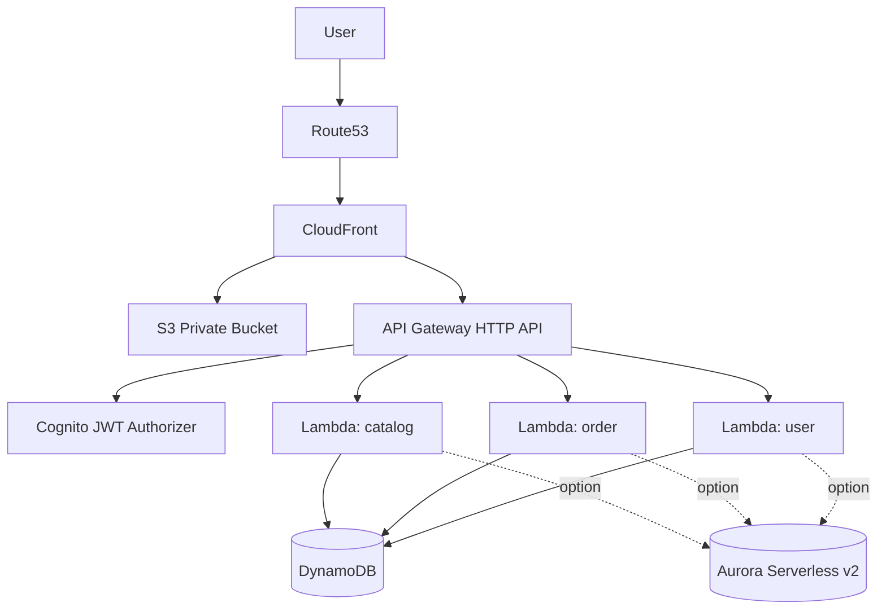

# ECサイト向け AWS インフラ将来構成（学習 + 本番運用を見据えたひな形）

> 目的: **CloudFront + S3 + Cognito + API Gateway + Lambda + Database** で、Next.js フロントエンドと認証付き API を提供する。
>
> 方針: 学習用途で理解しやすくしつつ、AWS 公式ベストプラクティスに寄せた **Terraform IaC** ベースで設計する。

---

## 0. 全体アーキテクチャ（要件反映）

```text
Internet
  ↓
Route53 (Hosted Zone / A-ALIAS)
  ↓
CloudFront (ACM TLS, OAC, WAF optional)
  ├─ Origin1: S3 (Next.js 静的アセット)
  └─ Origin2: API Gateway (JWT Authorizer with Cognito)
                                 ↓
                              Lambda
                                 ↓
                DynamoDB (default) or Aurora Serverless v2 (option)
```

### 設計のポイント
- **S3 は Private**、CloudFront からのみ OAC で参照可能。
- API は CloudFront 配下 `/api/*` に集約し、同一ドメイン運用で CORS を簡素化。
- 認証は Cognito User Pool の JWT を API Gateway で検証。
- Database は学習開始しやすい **DynamoDB** を標準、将来要件で **Aurora Serverless v2** へ切替可能な構成。
- 将来マイクロサービス化を見据え、`services/` 単位で Lambda/API を分離可能なモノレポ構成。

---

## 1. 推奨モノレポ構成

```text
hobby-ec-nextJS/
├─ apps/
│  ├─ web/                          # Next.js App Router
│  └─ api-contract/                 # OpenAPI/JSON Schema (任意)
├─ services/
│  ├─ catalog-api/                  # 商品取得系 Lambda
│  ├─ order-api/                    # 注文作成系 Lambda
│  └─ user-api/                     # ユーザー情報取得系 Lambda
├─ packages/
│  ├─ shared-types/                 # 型定義
│  └─ shared-utils/                 # 共通ロジック
├─ infra/
│  ├─ terraform/
│  │  ├─ envs/
│  │  │  ├─ dev/
│  │  │  └─ prod/
│  │  ├─ modules/
│  │  │  ├─ frontend/               # S3 + CloudFront + Route53 + ACM
│  │  │  ├─ auth/                   # Cognito
│  │  │  ├─ api/                    # API Gateway + Lambda
│  │  │  ├─ data-dynamodb/          # DynamoDB
│  │  │  └─ data-aurora/            # Aurora Serverless v2
│  │  └─ global/
│  │     └─ providers.tf
│  └─ README.md
├─ .github/
│  └─ workflows/
│     └─ deploy-frontend.yml
└─ docs/
   ├─ nextjs-ec-seo-guide.md
   └─ aws-infra-future-plan.md      # このドキュメント
```

---

## 2. Terraform IaC サンプルコード

> 以下は「学習しながら実運用へ伸ばせる」ことを重視したひな形。実際は環境ごとの tfvars で値を切替。

### 2.1 `infra/terraform/global/providers.tf`

```hcl
terraform {
  required_version = ">= 1.6.0"
  required_providers {
    aws = {
      source  = "hashicorp/aws"
      version = "~> 5.0"
    }
  }
}

provider "aws" {
  region = var.aws_region
}

# CloudFront 用 ACM は us-east-1 が必要
provider "aws" {
  alias  = "use1"
  region = "us-east-1"
}
```

### 2.2 `infra/terraform/modules/frontend/main.tf`（S3 + CloudFront + Route53）

```hcl
resource "aws_s3_bucket" "frontend" {
  bucket = var.frontend_bucket_name
}

resource "aws_s3_bucket_public_access_block" "frontend" {
  bucket                  = aws_s3_bucket.frontend.id
  block_public_acls       = true
  block_public_policy     = true
  ignore_public_acls      = true
  restrict_public_buckets = true
}

resource "aws_cloudfront_origin_access_control" "oac" {
  name                              = "${var.project}-oac"
  description                       = "OAC for private S3 origin"
  origin_access_control_origin_type = "s3"
  signing_behavior                  = "always"
  signing_protocol                  = "sigv4"
}

resource "aws_acm_certificate" "cert" {
  provider          = aws.use1
  domain_name       = var.domain_name
  validation_method = "DNS"
}

resource "aws_cloudfront_distribution" "cdn" {
  enabled             = true
  default_root_object = "index.html"
  aliases             = [var.domain_name]

  origin {
    domain_name              = aws_s3_bucket.frontend.bucket_regional_domain_name
    origin_id                = "s3-origin"
    origin_access_control_id = aws_cloudfront_origin_access_control.oac.id
  }

  origin {
    domain_name = var.apigw_domain_name
    origin_id   = "api-origin"

    custom_origin_config {
      http_port              = 80
      https_port             = 443
      origin_protocol_policy = "https-only"
      origin_ssl_protocols   = ["TLSv1.2"]
    }
  }

  default_cache_behavior {
    target_origin_id       = "s3-origin"
    viewer_protocol_policy = "redirect-to-https"
    allowed_methods        = ["GET", "HEAD", "OPTIONS"]
    cached_methods         = ["GET", "HEAD"]
    compress               = true

    forwarded_values {
      query_string = false
      cookies {
        forward = "none"
      }
    }
  }

  ordered_cache_behavior {
    path_pattern           = "/api/*"
    target_origin_id       = "api-origin"
    viewer_protocol_policy = "redirect-to-https"
    allowed_methods        = ["GET", "HEAD", "OPTIONS", "PUT", "POST", "PATCH", "DELETE"]
    cached_methods         = ["GET", "HEAD"]
    compress               = true

    forwarded_values {
      query_string = true
      headers      = ["Authorization", "Content-Type", "Origin"]
      cookies {
        forward = "all"
      }
    }
  }

  viewer_certificate {
    acm_certificate_arn      = aws_acm_certificate.cert.arn
    ssl_support_method       = "sni-only"
    minimum_protocol_version = "TLSv1.2_2021"
  }

  restrictions {
    geo_restriction {
      restriction_type = "none"
    }
  }
}

resource "aws_s3_bucket_policy" "frontend" {
  bucket = aws_s3_bucket.frontend.id
  policy = jsonencode({
    Version = "2012-10-17",
    Statement = [
      {
        Sid    = "AllowCloudFrontServicePrincipalReadOnly",
        Effect = "Allow",
        Principal = {
          Service = "cloudfront.amazonaws.com"
        },
        Action   = "s3:GetObject",
        Resource = "${aws_s3_bucket.frontend.arn}/*",
        Condition = {
          StringEquals = {
            "AWS:SourceArn" = aws_cloudfront_distribution.cdn.arn
          }
        }
      }
    ]
  })
}
```

### 2.3 `infra/terraform/modules/auth/main.tf`（Cognito）

```hcl
resource "aws_cognito_user_pool" "main" {
  name = "${var.project}-user-pool"

  password_policy {
    minimum_length    = 8
    require_lowercase = true
    require_uppercase = true
    require_numbers   = true
    require_symbols   = true
  }

  mfa_configuration = "OFF" # 学習用途。将来 ON/TOTP 推奨
}

resource "aws_cognito_user_pool_client" "web" {
  name         = "${var.project}-web-client"
  user_pool_id = aws_cognito_user_pool.main.id

  generate_secret                      = false
  allowed_oauth_flows_user_pool_client = true
  allowed_oauth_flows                  = ["code"]
  allowed_oauth_scopes                 = ["openid", "email", "profile"]
  callback_urls                        = ["https://${var.domain_name}/auth/callback"]
  logout_urls                          = ["https://${var.domain_name}/logout"]
  supported_identity_providers         = ["COGNITO"]
}

resource "aws_cognito_user_pool_domain" "domain" {
  domain       = "${var.project}-auth"
  user_pool_id = aws_cognito_user_pool.main.id
}
```

### 2.4 `infra/terraform/modules/api/main.tf`（API Gateway + Lambda + JWT認証）

```hcl
resource "aws_iam_role" "lambda_exec" {
  name = "${var.project}-lambda-role"
  assume_role_policy = jsonencode({
    Version = "2012-10-17",
    Statement = [{
      Effect = "Allow",
      Principal = { Service = "lambda.amazonaws.com" },
      Action = "sts:AssumeRole"
    }]
  })
}

resource "aws_iam_role_policy_attachment" "lambda_basic" {
  role       = aws_iam_role.lambda_exec.name
  policy_arn = "arn:aws:iam::aws:policy/service-role/AWSLambdaBasicExecutionRole"
}

resource "aws_lambda_function" "catalog" {
  function_name = "${var.project}-catalog"
  role          = aws_iam_role.lambda_exec.arn
  runtime       = "nodejs20.x"
  handler       = "index.handler"
  filename      = var.catalog_lambda_zip

  environment {
    variables = {
      TABLE_NAME = var.product_table_name
    }
  }
}

resource "aws_apigatewayv2_api" "http" {
  name          = "${var.project}-http-api"
  protocol_type = "HTTP"

  cors_configuration {
    allow_origins = ["https://${var.domain_name}"]
    allow_methods = ["GET", "POST", "OPTIONS"]
    allow_headers = ["Authorization", "Content-Type"]
  }
}

resource "aws_apigatewayv2_authorizer" "jwt" {
  api_id           = aws_apigatewayv2_api.http.id
  authorizer_type  = "JWT"
  identity_sources = ["$request.header.Authorization"]
  name             = "cognito-jwt"

  jwt_configuration {
    audience = [var.cognito_client_id]
    issuer   = var.cognito_issuer
  }
}

resource "aws_apigatewayv2_integration" "catalog" {
  api_id                 = aws_apigatewayv2_api.http.id
  integration_type       = "AWS_PROXY"
  integration_uri        = aws_lambda_function.catalog.invoke_arn
  payload_format_version = "2.0"
}

resource "aws_apigatewayv2_route" "get_products" {
  api_id             = aws_apigatewayv2_api.http.id
  route_key          = "GET /products"
  target             = "integrations/${aws_apigatewayv2_integration.catalog.id}"
  authorizer_id      = aws_apigatewayv2_authorizer.jwt.id
  authorization_type = "JWT"
}

resource "aws_apigatewayv2_stage" "default" {
  api_id      = aws_apigatewayv2_api.http.id
  name        = "$default"
  auto_deploy = true
}
```

### 2.5 `infra/terraform/modules/data-dynamodb/main.tf`

```hcl
resource "aws_dynamodb_table" "products" {
  name         = "${var.project}-products"
  billing_mode = "PAY_PER_REQUEST"
  hash_key     = "pk"

  attribute {
    name = "pk"
    type = "S"
  }

  point_in_time_recovery {
    enabled = true
  }
}

resource "aws_dynamodb_table" "orders" {
  name         = "${var.project}-orders"
  billing_mode = "PAY_PER_REQUEST"
  hash_key     = "order_id"

  attribute {
    name = "order_id"
    type = "S"
  }

  point_in_time_recovery {
    enabled = true
  }
}
```

### 2.6 `infra/terraform/modules/data-aurora/main.tf`（選択肢）

```hcl
resource "aws_rds_cluster" "aurora" {
  cluster_identifier      = "${var.project}-aurora"
  engine                  = "aurora-postgresql"
  engine_mode             = "provisioned"
  engine_version          = "15.4"
  database_name           = "ecdb"
  master_username         = var.db_username
  master_password         = var.db_password
  db_subnet_group_name    = var.db_subnet_group_name
  vpc_security_group_ids  = [var.db_sg_id]
  storage_encrypted       = true
  backup_retention_period = 7

  serverlessv2_scaling_configuration {
    min_capacity = 0.5
    max_capacity = 4
  }
}

resource "aws_rds_cluster_instance" "aurora_instance" {
  identifier         = "${var.project}-aurora-instance-1"
  cluster_identifier = aws_rds_cluster.aurora.id
  instance_class     = "db.serverless"
  engine             = aws_rds_cluster.aurora.engine
  engine_version     = aws_rds_cluster.aurora.engine_version
}
```

---

## 3. API 設計例（REST）

- `GET /api/products` : 商品一覧取得（認証必須）
- `POST /api/orders` : 注文作成（認証必須）
- `GET /api/users/me` : ログインユーザー情報（認証必須）

レスポンス標準:
- 成功: `{ data, meta }`
- 失敗: `{ error: { code, message, details } }`

---

## 4. Next.js 配信戦略（SEO/SSG/ISR）

- 商品一覧・商品詳細は `generateStaticParams` + `revalidate` で ISR。
- 在庫/価格の即時性が必要な箇所は API 経由でクライアント再取得。
- `next build` 後、`next export` または静的出力対応構成でアセットを S3 配置。
- CloudFront キャッシュ戦略:
  - HTML: 短め TTL
  - 画像/JS/CSS: 長め TTL + ファイル名ハッシュ

---

## 5. デプロイ手順（初回）

1. AWS アカウントで Hosted Zone を作成（Route53）。
2. Terraform Backend（S3 + DynamoDB lock）を作成。
3. `infra/terraform/envs/dev` で `terraform init`。
4. `terraform plan` で差分確認。
5. `terraform apply` でリソース作成。
6. Next.js を build し S3 に同期。
7. CloudFront invalidation 実行。
8. Cognito ユーザー作成・動作確認。
9. API（/products, /orders, /users/me）の疎通確認。

### 実行コマンド例

```bash
cd infra/terraform/envs/dev
terraform init
terraform plan -out tfplan
terraform apply tfplan

cd ../../../../apps/web
npm ci
npm run build
aws s3 sync ./out s3://<frontend-bucket> --delete
aws cloudfront create-invalidation --distribution-id <dist-id> --paths "/*"
```

---

## 6. ローカル開発環境構築手順

1. Node.js 20 系 + npm を導入。
2. AWS CLI / Terraform を導入。
3. `aws configure sso` もしくは `aws configure` 実施。
4. リポジトリを clone 後、依存をインストール。
5. `.env.local` に Cognito/API の接続先を設定。
6. `npm run dev` で Next.js 起動。
7. Lambda は `sam local` または `serverless-offline` で擬似実行（任意）。

```bash
npm ci
npm run dev
```

推奨 `.env.local` 例:

```bash
NEXT_PUBLIC_COGNITO_USER_POOL_ID=ap-northeast-1_xxxxx
NEXT_PUBLIC_COGNITO_CLIENT_ID=xxxxxxxx
NEXT_PUBLIC_API_BASE_URL=https://<domain>/api
```

---

## 7. AWS リソース依存関係図



---

## 8. セキュリティ設計

### 必須対策
- S3 Block Public Access を全有効化。
- OAC + バケットポリシーで CloudFront 経由のみ許可。
- CloudFront Viewer Protocol Policy: `redirect-to-https`。
- IAM ロールは Lambda ごとの最小権限（テーブル単位で分離）。
- API Gateway CORS は `https://<domain>` のみに制限。
- Secrets は AWS Secrets Manager / SSM Parameter Store に保存。
- CloudWatch Logs + CloudTrail を有効化。

### 追加推奨
- AWS WAF を CloudFront にアタッチ。
- Cognito MFA を有効化（本番）。
- Security Hub / GuardDuty を有効化。

---

## 9. CI/CD（GitHub Actions）

`push` 時にフロントエンド配信まで自動化。

```yaml
name: deploy-frontend
on:
  push:
    branches: ["main"]

jobs:
  deploy:
    runs-on: ubuntu-latest
    permissions:
      id-token: write
      contents: read

    steps:
      - uses: actions/checkout@v4
      - uses: actions/setup-node@v4
        with:
          node-version: 20

      - name: Install
        run: npm ci

      - name: Build
        run: npm run build

      - name: Configure AWS Credentials (OIDC)
        uses: aws-actions/configure-aws-credentials@v4
        with:
          role-to-assume: ${{ secrets.AWS_ROLE_ARN }}
          aws-region: ap-northeast-1

      - name: Deploy static assets
        run: aws s3 sync ./apps/web/out s3://${{ secrets.FRONTEND_BUCKET }} --delete

      - name: Invalidate CloudFront
        run: aws cloudfront create-invalidation --distribution-id ${{ secrets.CF_DIST_ID }} --paths "/*"
```

---

## 10. コスト概算（月額の目安）

> 小〜中規模トラフィック想定（学習環境〜PoC）。リージョンやアクセス量で変動。

- Route53: 数百円程度（Hosted Zone + クエリ数）
- CloudFront: 数百円〜数千円（転送量・リクエスト次第）
- S3: 数十円〜数百円（容量 + GET/PUT）
- Cognito: MAU 次第（無料枠内なら 0〜）
- API Gateway HTTP API: リクエスト課金（低〜中）
- Lambda: 実行回数/実行時間次第（無料枠活用可）
- DynamoDB On-Demand: 使用量課金で始めやすい
- Aurora Serverless v2: 最小 ACU 維持で DynamoDB より高くなりやすい
- CloudWatch Logs: 保持期間次第

**学習初期は DynamoDB 構成がコスト最適。**

---

## 11. 将来マイクロサービス化への拡張方針

- API をドメイン単位（catalog/order/user）で Lambda + テーブル分離。
- EventBridge を導入し、注文確定イベントを非同期連携（通知/在庫更新）。
- 将来は API Gateway のルートをサービス別に切り、チーム単位でデプロイ独立。
- IaC は module をサービス別に分割し、state も段階的に分離。

---

## 12. 学習ロードマップ（おすすめ順）

1. S3 + CloudFront (OAC) で静的配信。
2. Cognito ログイン実装（Hosted UI + PKCE）。
3. API Gateway + Lambda + JWT 認可。
4. DynamoDB 設計（PK/SK, GSI, TTL）。
5. GitHub Actions で自動デプロイ。
6. 監視（CloudWatch Dashboard/Alarm）追加。
7. WAF・MFA・Secrets 管理を強化。
8. Aurora 版も試して比較。

---

このドキュメントをベースに、次フェーズで `infra/terraform/` 実コードを段階的に実装すれば、学習効率と実運用性を両立しやすいです。

## ローカル検証テンプレート

LocalStack を使ったローカル検証環境は `docs/localstack-aws-serverless-template.md` を参照してください。
