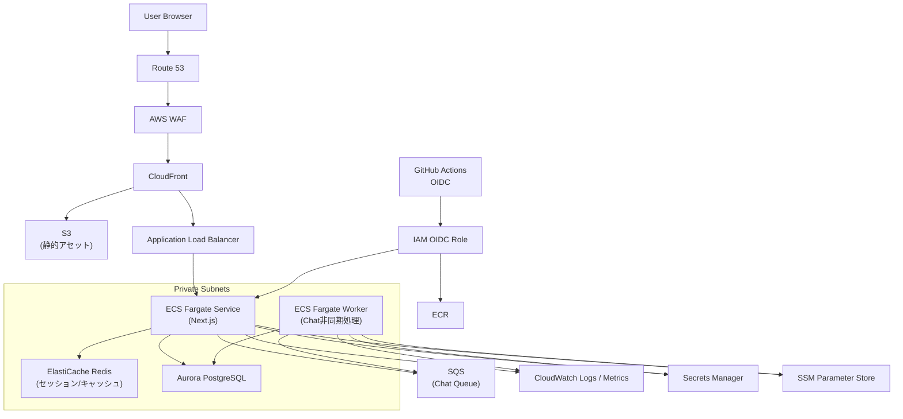

# AWS 将来構成案アーキテクチャ図（提案）

将来スケールを見据えた構成案です。現行 Terraform 実装とは別に、段階的移行を想定した図として記載します。

## 補足
- 本図は「将来構成案」であり、現行の `infra/terraform/main.tf` にそのまま一致するものではありません。
- 目的は、配信最適化（CloudFront）、可用性向上（Fargate + ALB）、データ永続化（Aurora）、チャット負荷分離（SQS + Worker）の方向性を可視化することです。
