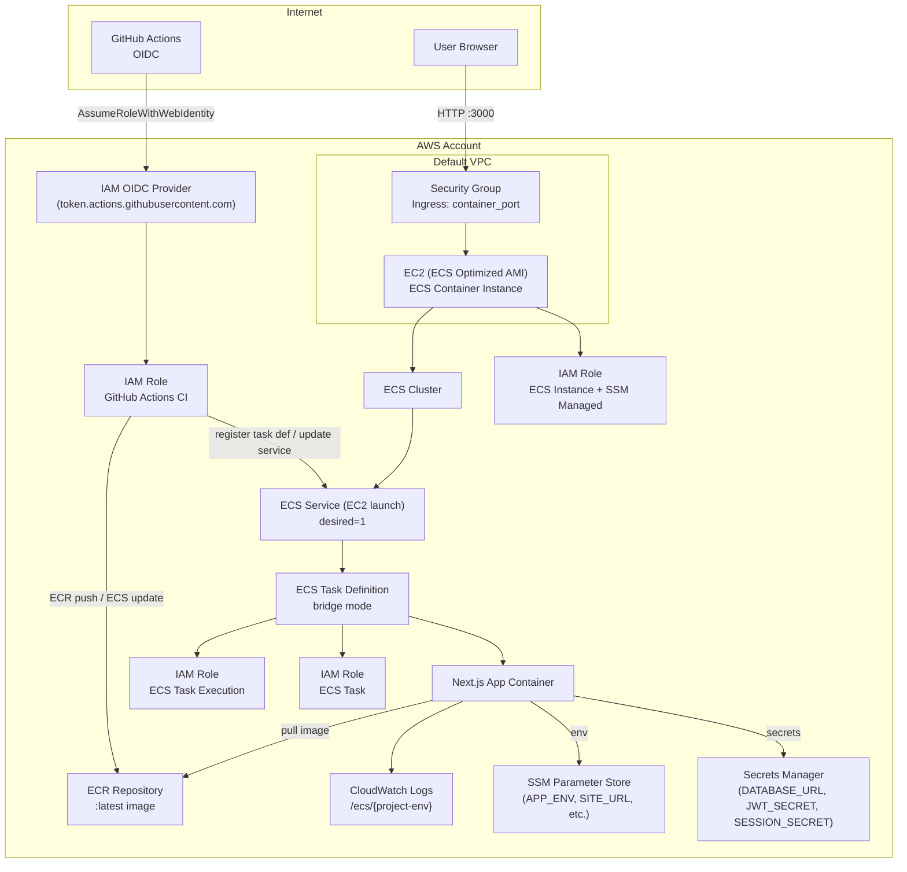

# Terraform 実装ベース AWS アーキテクチャ図（現行）

この図は `infra/terraform/*.tf` から読み取れる **実装済み構成のみ** を反映しています。

```mermaid
flowchart TB
  subgraph Internet
    User["User Browser"]
    GH["GitHub Actions\nOIDC"]
  end

  subgraph AWS["AWS Account"]
    OIDC["IAM OIDC Provider\n(token.actions.githubusercontent.com)"]
    CIRole["IAM Role\nGitHub Actions CI"]

    subgraph DefaultVPC["Default VPC"]
      EC2SG["Security Group\nIngress: container_port"]
      EC2["EC2 (ECS Optimized AMI)\nECS Container Instance"]
    end

    ECSCluster["ECS Cluster"]
    ECSService["ECS Service (EC2 launch)\ndesired=1"]
    TaskDef["ECS Task Definition\nbridge mode"]
    App["Next.js App Container"]

    ECR["ECR Repository\n:latest image"]
    CWL["CloudWatch Logs\n/ecs/{project-env}"]

    SSMParam["SSM Parameter Store\n(APP_ENV, SITE_URL, etc.)"]
    Secrets["Secrets Manager\n(DATABASE_URL, JWT_SECRET, SESSION_SECRET)"]

    TaskExecRole["IAM Role\nECS Task Execution"]
    TaskRole["IAM Role\nECS Task"]
    EC2Role["IAM Role\nECS Instance + SSM Managed"]
  end

  User -->|HTTP :3000| EC2SG --> EC2

  EC2 --> ECSCluster --> ECSService --> TaskDef --> App

  App --> CWL
  App -->|pull image| ECR
  App -->|env| SSMParam
  App -->|secrets| Secrets

  TaskDef --> TaskExecRole
  TaskDef --> TaskRole
  EC2 --> EC2Role

  GH -->|AssumeRoleWithWebIdentity| OIDC
  OIDC --> CIRole
  CIRole -->|ECR push / ECS update| ECR
  CIRole -->|register task def / update service| ECSService

```
